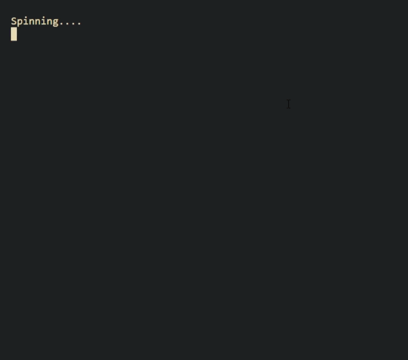

# Wheel-of-Fortune-Game


## About the Project
I built this as my programming final for NCEA Level 3 Digital Technologies in **May, 2025**.

This game was built with **Python** and uses techniques such as:
- **Object Oriented Programming**, 
- **Static and Class Methods**, 
- **File Input/Output**,
    - **Pickling**
- **Error Handling**, 
- **Input Validation**, 
- **String Manipulation**
- **Pep-8 Style Compliance**

The game handles 2-7 players and can be played for any amount of rounds.

The rules are the same as any Wheel of Fortune style game.

## Settings
You can edit settings like **Round Limit**, **Player Count**, **Settings Preset Name**, and **Export/Import** other settings.

To edit the wheel widgets (what the wheel spins), edit `wheel_widgets.txt`. Note that `LOSE A TURN` and `BANKRUPT` must be in that format.

**NOTE:** Phrase customisation has not been added as part of the settings -- you will have to manually edit `phrases.txt` to change the phrases or change the file path in the `Settings` class `__init__` method.
## Installation
`colorama` is the only dependency needed for this game.
```
pip install colorama
```
## How to Run
```
python wheel_of_fortune_game.py
```
## File Structure
```
├── settings_presets/
    └── SHORT ROUND.pkl
├── README.md
├── example_gameplay.gif
├── phrases.txt
├── wheel_of_fortune_game.py
└── wheel_widgets.txt
```
